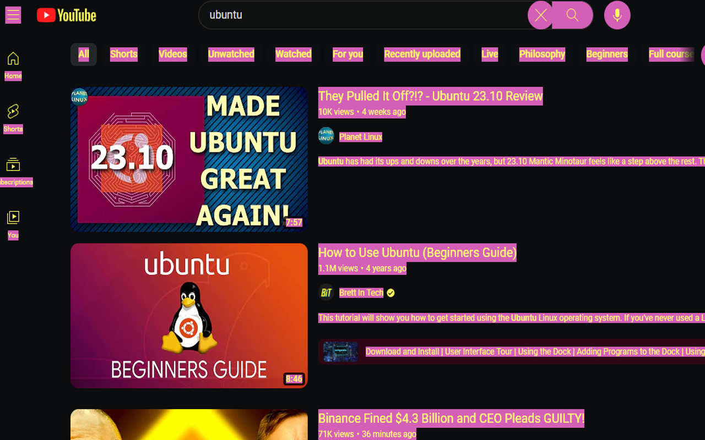
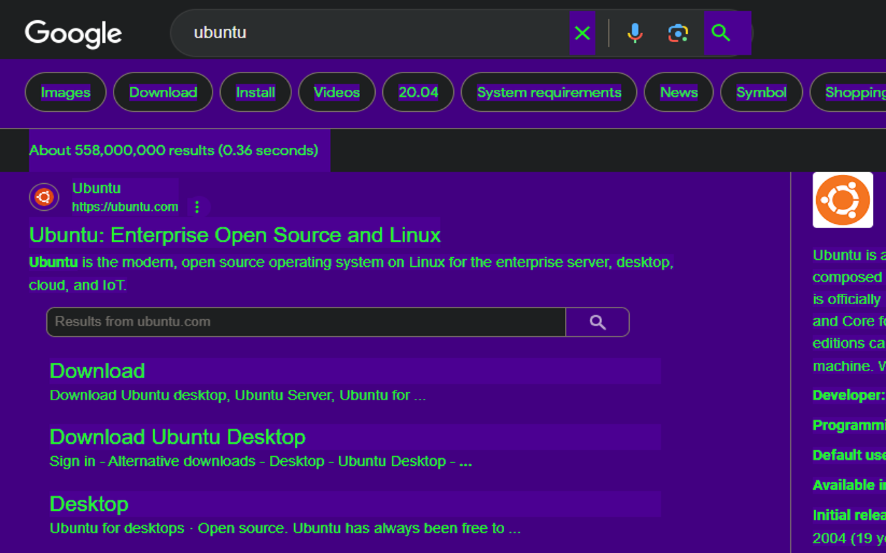
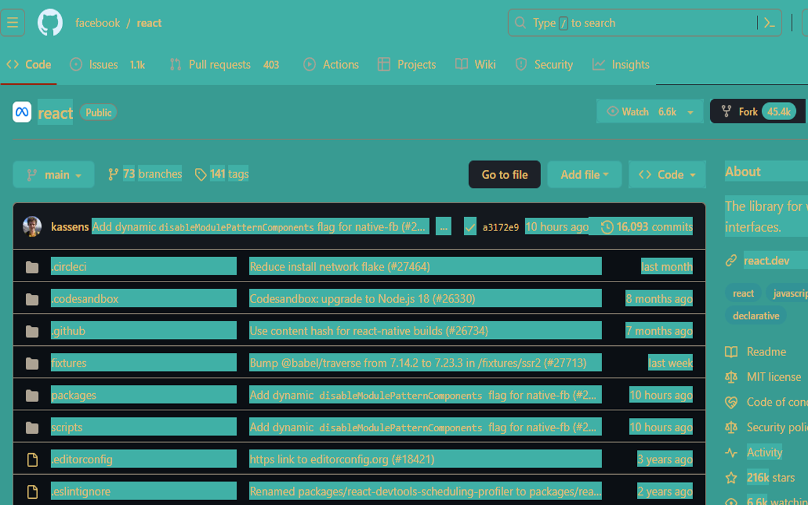
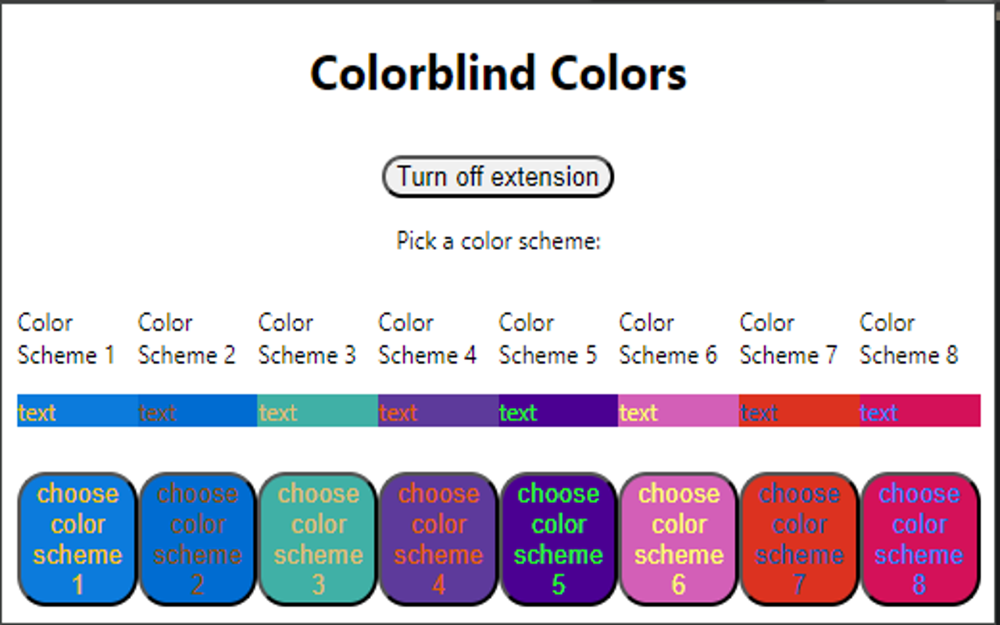

# High Contrast Colors for the Colorblind Chrome Extension. 

This is an Chrome extension that allows Colorblind individuals to use high contrast colors to reduce eye strain and make browsing the web easier. 

Featuring 8 high contrast colorset specifically for the colorblind, users can select the one that works best for their vision and experience the web with new clarity. 

Tested on websites you use! Such as Reddit, Google, Github, Dev.to and Medium. The current implmenetation works well on most websites. All websites are built differently and some may have bad practices that interfere with this plugin which are mostly inline styles with the important property. 

No ads for spyware. 100% free. Try it for yourself and see better today!

# Description

This Chrome Extension uses high contrast color scheme(s) for the colorblind to help them distinguish items on their screen by using the proper contrast. 

Credit for color schemes to David Nichols at https://davidmathlogic.com/colorblind/#%23D81B60-%231E88E5-%23FFC107-%23004D40

# Installation

Download this github repo with the code button

Unzip the files into a folder.

then in any chrome based browser, go to extensions in settings

Turn Developer mode on

Load the unzipped folder into your browser with the "Load Unpacked" button that appears when you turn on Developer mode.

Click the extension icon.

It looks like this and is in your browser tray:

Or larger,

Or, larger

# How to use

open menu and select a color scheme. Reload the page. On all subsequent pages, your theme will load until you press the off button or select a different one. 

# Project History

This project was conceived by me during HackNC 2023 and was our project. The original project can be found at: https://github.com/JeffreyDinackus/accessibility-colors-chrome-hacknc-2023/tree/main
